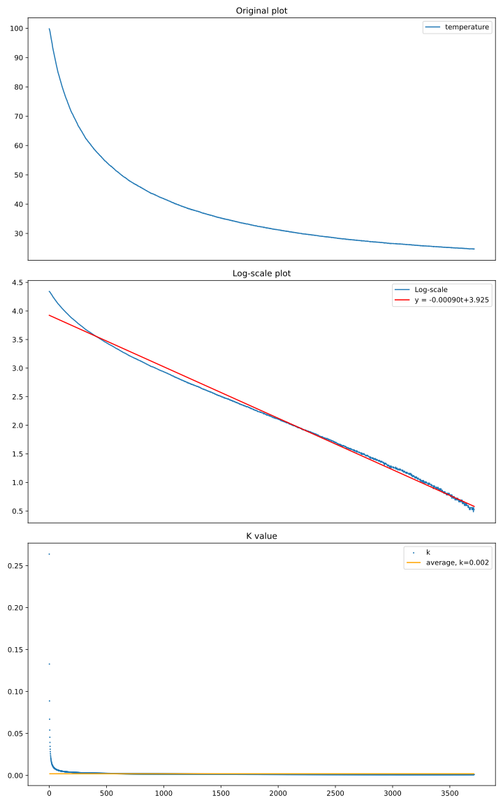

# README

## Introduction
In this project, we're going to measure time using some physics phenomenon. We choose to use [Newton's law of cooling](https://en.wikipedia.org/wiki/Newton%27s_law_of_cooling) as the basics to figure out the time.

## Set up the environment
```shell script
$ pip install -r requirements.txt
```

## Experiments
To find k, we test it different ways:
* Finding the mean of k
* Using linear regression in log-scale


## Configuration
```python
K: float = <constant>
T_s: float = <surrounding temperature>
T_initial: float = <intial temperature>

HOST: str = "<address of RPi>"
PORT: str = "<Port to be used>"
```

## Training
The training file is located in `train` folder. The default value is listed below.
```shell
$ python train/train.py \
    --file_name exp/record.csv \
    --weight exp/model.pt \
    --epochs 20 \
    --batch_size 128 \
    --hidden_dim 16 \
    --lr 1e-2 \
    --weight_decay 1e-5
```

## Running code
To successfully activate the code, both `clock.py` and `server.py` should be started:
> Note: `clock.py` should be run first
```shell script
# For simulation
$ python clock.py
$ python sensor_sim.py

# For true running
$ python clock.py
$ python sensor.py
``` 

The result would be like

<p align="center">
    
</p>